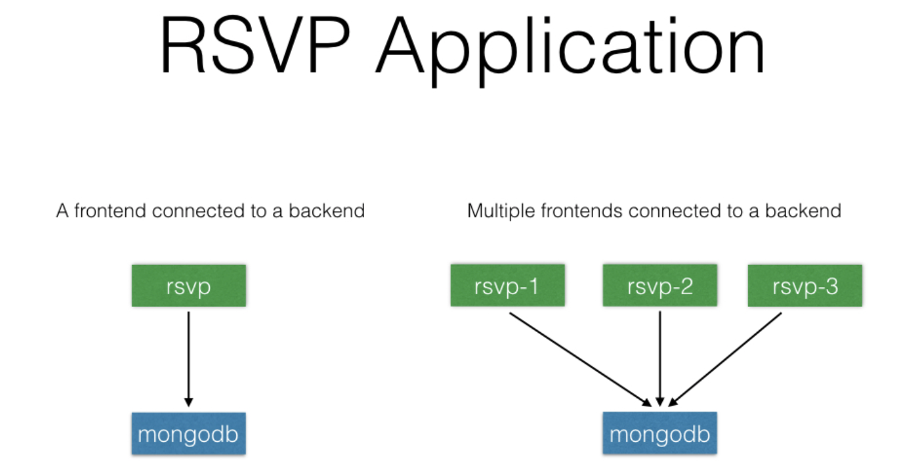

### RSVP Application

This deployes a sample RSVP application provided [here](https://raw.githubusercontent.com/cloudyuga/rsvpapp/master/rsvp.py). Users are allowed to  register for an event once a username and email id are provided. These get saved in a MongoDB database. The application consists of a backend database and a frontend. For the backend, uses a MongoDB database, and for the frontend, we have a Python Flask-based application.





### Run Application

- Install [minikube](https://github.com/kubernetes/minikube/releases)
- Clone this repository
- From the kubernetes directory run the following:
  - kubectl create -f mongo-db.yaml
  - kubectl create -f mongo-service.yaml
  - kubectl create -f web-service.yaml
  - kubectl create of web-frontend.yaml
  

```
kubernetes-rsvp $ kubectl get deployments
NAME               DESIRED   CURRENT   UP-TO-DATE   AVAILABLE   AGE
application-db     1         1         1            1           54m
rsvp-application   3         3         3            3           32m
kubernetes-rsvp $ kubectl get svc
NAME                   TYPE        CLUSTER-IP       EXTERNAL-IP   PORT(S)        AGE
kubernetes             ClusterIP   10.96.0.1        <none>        443/TCP        23d
mongodb                ClusterIP   10.104.244.238   <none>        27017/TCP      2m
mongodb-service        ClusterIP   10.99.11.2       <none>        27017/TCP      7m
web-frontend-service   NodePort    10.100.48.233    <none>        80:32494/TCP   31m
```

```
nodePort: 32494
```

- run **minikube ip**
- get the ip address and open it in a web-browser with the nodePort for the web-service as shown below:

```
kubernetes-rsvp $ minikube ip
192.168.99.100
```

```
address: http://192.168.99.100:32494
```